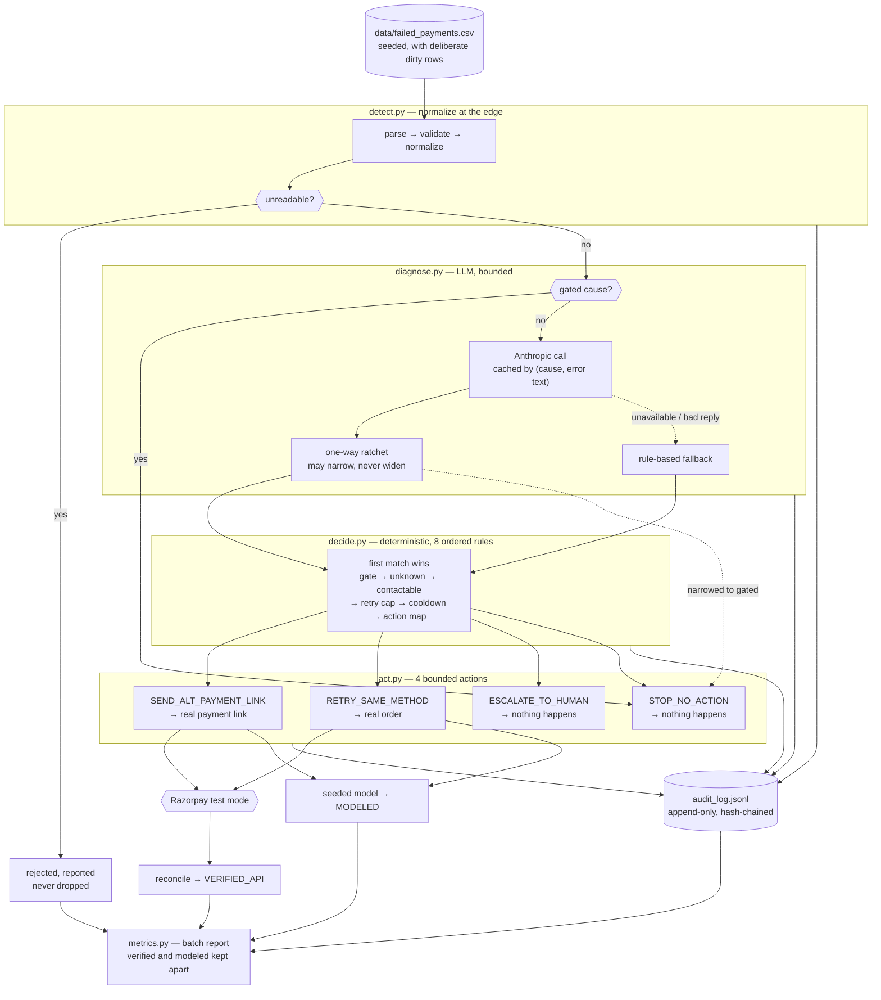

# Revenue Recovery Agent

Built for the **Razorpay AI Buildathon — Track 03: AI Revenue Recovery**.

Detects at-risk revenue (failed payments) and runs a bounded, auditable recovery
workflow: **detect → diagnose → decide → act → stop**.

```bash
python scripts/generate_synthetic_data.py   # seeded batch
python scripts/run_batch.py                 # dry run, touches nobody
python scripts/run_batch.py --live          # real Razorpay test-mode calls
python -m pytest -q                         # 394 tests
```

---

## The three design commitments

### 1. Restraint is a measured result, not a missing feature

Three failure causes are hard-gated — the agent may never retry or re-contact
them:

| Cause | Why it's gated |
|---|---|
| `fraud_suspected` | Retrying is a compliance problem, not an opportunity |
| `card_blocked` | The issuer has already said no; asking again is harassment |
| `customer_cancelled` | The customer expressed intent — respect it |

That gate lives in [app/models.py](app/models.py) as `UNRECOVERABLE_REASONS` and
is enforced by deterministic code in [app/decide.py](app/decide.py), **not** by
asking an LLM to behave. The batch report treats "₹ deliberately not chased" as a
headline figure alongside "₹ recovered", and `stop_compliance_pct` must read
100.0 — anything less is a failed run, not a low score.

A fourth path exists for causes outside the known taxonomy: they classify as
`UNKNOWN` and escalate to a human. The agent does not guess an action for a cause
it doesn't recognise.

### 2. The LLM can never widen the agent's permissions — only narrow them

This is the one invariant [app/diagnose.py](app/diagnose.py) exists to enforce.

| Situation | What the model is allowed to do |
|---|---|
| Cause is already gated | **Not consulted at all.** No prompt is sent. |
| Cause is recoverable, model says "this is fraud" | **Honoured.** Case is downgraded and stops. |
| Cause is unknown, model says "this is really a bank timeout" | **Refused.** Case stays UNKNOWN and goes to a human. |
| Model suggests an action outside the closed set | **Discarded.** |
| Model and the action map disagree | **The map wins.** |

Every refused suggestion is recorded in `Diagnosis.boundary_violations` and
counted in the report as `boundary_violations_refused`, so "the model tried to
overstep N times" is a number rather than a reassurance. The ratchet is enforced
twice — once in the diagnose stage, and again in `decide.effective_recoverability`,
which takes the stricter of the two readings. The place where money moves is the
wrong place to trust a caller.

`tests/test_agent.py::test_an_llm_that_tries_to_unlock_everything_changes_nothing`
runs the whole batch against a model that insists every case is a recoverable bank
timeout and should be charged again. The decisions come out identical.

### 3. Verified rupees and modeled rupees are never summed

Every recovery action creates a **real Razorpay test-mode object**. A payment link
can be paid by hand with a test card, and `POST /agent/reconcile` then asks
Razorpay whether it was — that response is the *only* source of a verified rupee.
Everything else resolves through a seeded, explicitly-labeled outcome model.

`recovered_verified` and `recovered_modeled` are separate lines with separate
rates, and **no field anywhere in the report adds them together**. That is
enforced by `test_no_field_anywhere_sums_verified_and_modeled`, which walks the
serialised report looking for the forbidden sum.

---

## Architecture



The spine is leak-type agnostic. `LeakType` is tagged on every case from ingestion
onward, so cart abandonment / failed subscriptions / overdue invoices plug in by
supplying a cause taxonomy and an action map.

---

## Project structure

```
app/
  main.py                    FastAPI endpoints
  config.py                  Settings loaded from .env
  models.py                  Domain models + the UNRECOVERABLE_REASONS gate
  detect.py                  Detect: normalize, validate, reject, aggregate
  diagnose.py                Diagnose: LLM behind the gate, one-way ratchet
  decide.py                  Decide: 8 ordered rules, cause → bounded action
  act.py                     Act: real Razorpay calls + settlement accounting
  audit.py                   Append-only, hash-chained audit trail
  metrics.py                 Batch report + invariant self-checks
  agent.py                   Orchestrator: the whole spine, one flat loop
  services/
    razorpay_client.py       Every Razorpay call lives here
    llm_client.py            Every Anthropic call lives here
scripts/
  generate_synthetic_data.py Seeded batch (clean + dirty + policy-edge rows)
  run_batch.py               CLI: run, reconcile, verify the audit chain
tests/                       394 tests
data/
  failed_payments.csv        Generated batch
  audit_log.jsonl            Generated trail (gitignored)
```

### Why money is integer paise

`amount_paise: int` is the canonical value everywhere; `amount_inr` is a derived,
display-only property. Razorpay's API speaks paise, and integer arithmetic means
the ₹ totals in the final report are exact rather than float-drifted. There's a
test that accumulates 1000 × ₹0.10 and asserts the total is exactly ₹100.00.

### Why the detect stage is so defensive

Real recovery data is dirty, and a row silently dropped is money silently
vanishing from the metrics. So every row is normalized and validated
independently:

- **Rejected** (hard data faults, reported not dropped): missing `payment_id`,
  duplicate `payment_id`, unparseable/non-positive amount, unparseable
  `created_at`.
- **Accepted with warnings** (carried into the audit trail): unmappable cause,
  no usable contact channel, future timestamps (clamped), negative retry count,
  non-INR currency.

`cases + rejected == rows_read` is asserted as a test invariant *and* ships as a
self-check inside every report.

The generator injects eight deliberate dirty rows and two policy-edge rows
precisely so these paths are demonstrable rather than theoretical — see
`DIRTY_ROW_BUILDERS` and `EDGE_ROW_BUILDERS` in
[scripts/generate_synthetic_data.py](scripts/generate_synthetic_data.py), where
each one is annotated with what it's meant to prove.

> Timestamps are absolute and anchored to generation time, so **regenerate the
> batch before a demo**. A stale CSV drifts every `last_attempt_at` out of the
> cooldown window, and the cooldown rule then looks dead when it is only
> unexercised. The seed fixes the batch's *shape*, not its absolute dates.

---

## The decide stage: 8 rules, in order

First match wins, and every `Decision` records which rule fired.

| # | Rule | Condition | Action |
|---|---|---|---|
| 1 | `GATE_UNRECOVERABLE_CAUSE` | fraud / blocked card / cancelled | **STOP** |
| 2 | `ESCALATE_UNKNOWN_CAUSE` | cause outside the taxonomy | **HUMAN** |
| 3 | `ESCALATE_NOT_CONTACTABLE` | no usable email or phone | **HUMAN** |
| 4 | `ESCALATE_RETRY_CAP_REACHED` | `retry_count >= MAX_RETRY_ATTEMPTS` | **HUMAN** |
| 5 | `STOP_COOLDOWN_NOT_ELAPSED` | inside `RETRY_COOLDOWN_HOURS` | **STOP** |
| 6 | `RETRY_TRANSIENT_FAULT` | someone else's outage | **RETRY** |
| 7 | `LINK_CUSTOMER_ACTION_REQUIRED` | the customer must do something | **LINK** |
| 8 | `ESCALATE_NO_ACTION_MAPPED` | recoverable but unmapped | **HUMAN** |

The ordering *is* the safety property: the two hard stops are checked first and
the two customer-contacting rules last, so a case cannot reach a contact rule
without having cleared every gate. Rule 8 can never fire today — a test asserts
the action map covers `RECOVERABLE_REASONS` exactly — and it exists so that adding
a cause without deciding its action fails closed instead of guessing.

**Why the cause → action split:** transient infrastructure faults
(`bank_timeout`, `gateway_error`, `network_error`, `issuer_unavailable`) mean
nothing is wrong with the customer's instrument, so re-presenting it is fair.
Customer-side faults (`insufficient_funds`, `card_expired`, `invalid_otp`) mean
re-charging would fail identically, so they get a fresh link instead.

---

## Act: what actually happens

| Action | Razorpay call | Can it be verified? |
|---|---|---|
| `SEND_ALT_PAYMENT_LINK` | `payment_link.create` | **Yes** — pay it, then reconcile |
| `RETRY_SAME_METHOD` | `order.create` | **No** — modeled only |
| `ESCALATE_TO_HUMAN` | none | n/a |
| `STOP_NO_ACTION` | none | n/a |

**A stated limitation, not a hidden one.** Razorpay test mode cannot silently
re-charge a failed payment without a stored token or mandate, and the synthetic
batch has neither. So `RETRY_SAME_METHOD` creates a real Order representing the
re-presentment rather than pretending an authorisation happened. The consequence
is that **no retry rupee is ever verifiable in this build** — only payment links
can be. That is asserted by `test_an_order_is_never_reconcilable`.

The outcome model's probabilities in `act.BASE_RECOVERY_PROBABILITY` are **stated
assumptions, not measurements**: a card that has already expired rarely converts,
a bank that timed out usually clears on a second pass, and each prior failed
attempt decays the probability by 0.75. They are plausible, and that is the
strongest claim available. Labelling the column `MODELED` and refusing to sum it
with the verified one is the honest way to use a number nobody has measured.

Draws use `sha256(seed:payment_id)` rather than `hash()`, because Python
randomises string hashing per process — `hash()` would make the modeled column
move between runs of the same batch, and a metric that moves when nothing moved
is not a metric.

---

## Audit trail

One JSON object per line in `data/audit_log.jsonl`. Every stage of every case,
with its reasoning.

**Append-only is structural.** [app/audit.py](app/audit.py) offers `append`,
`read_all` and `verify`. There is no update, no delete, no rewrite, and the file
is only ever opened in `"a"` mode. A test asserts the class exposes no mutating
method, and `reset()` refuses to touch the configured trail.

**Tamper-evident.** Each entry stores the previous entry's hash, and its own hash
covers both its content and that `prev_hash`. Editing an entry, deleting one, or
reordering two all break the chain, and `GET /audit/verify` reports the exact
sequence number where it breaks.

```bash
python scripts/run_batch.py --verify-audit
#   entries: 399
#   intact:  True
```

Hashing detects tampering; it does not prevent it. Someone who rewrites the whole
file from genesis produces a valid chain — there is a test that says so out loud.
What the chain guarantees is that a *partial* edit cannot pass, which is the
realistic threat for a local file.

**Ordering that is load-bearing:** the decision is appended *before* the action
executes. If the process dies mid-call there is a record of what it was about to
do, rather than a Razorpay object nobody can account for.

---

## Setup

1. **Virtual environment and dependencies**
   ```bash
   python -m venv venv
   source venv/bin/activate        # Windows: venv\Scripts\activate
   pip install -r requirements.txt
   ```

2. **Razorpay TEST MODE keys**
   - Log in at https://dashboard.razorpay.com with the **Test Mode** toggle ON
   - Settings → API Keys → Generate Test Key
   - The client **refuses to start** if the key doesn't begin `rzp_test` — a live
     key here would mean real customers getting real payment requests from a demo.

3. **Anthropic API key** — for the diagnose stage
   - https://console.anthropic.com/settings/keys
   - Optional. Without it, diagnosis uses the rule-based path and the report says
     so (`llm_used: false`). Nothing else changes.

4. **Configure environment**
   ```bash
   cp .env.example .env      # then paste your keys in
   ```

5. **Generate the batch** (seeded — same seed, same batch shape, every time)
   ```bash
   python scripts/generate_synthetic_data.py
   ```

6. **Run**
   ```bash
   python scripts/run_batch.py            # CLI report
   uvicorn app.main:app --reload           # HTTP, docs at /docs
   ```

7. **Test**
   ```bash
   python -m pytest -q
   ```

---

## Endpoints

Everything that could touch a customer defaults to `dry_run=true`.

| Endpoint | What it shows |
|---|---|
| `GET /health` | Liveness + which integrations are actually wired |
| `POST /agent/run` | The whole workflow. `?dry_run=false` to go live |
| `GET /agent/stopped` | **Read this first.** Cases the agent refused, and why |
| `GET /agent/escalations` | Cases handed to a human |
| `GET /agent/decisions` | Every case + diagnosis + decision + outcome |
| `GET /agent/links` | Razorpay artefacts created, with payable URLs |
| `POST /agent/reconcile` | Ask Razorpay which links got paid → verified ₹ |
| `GET /metrics` | The batch report |
| `GET /metrics/text` | Same numbers, rendered for a terminal |
| `GET /audit` | The append-only trail, filterable |
| `GET /audit/verify` | Re-walk the hash chain |
| `GET /detect/run` | Full detect output: cases, rejects, summary |
| `GET /detect/rejected` | Rows that couldn't be ingested, each with a reason |
| `GET /detect/unrecoverable` | The cases the agent refuses to touch |
| `GET /payments`, `/payments/{id}`, `/payments/summary` | Normalized batch views |

### Proving the verified-rupee loop

```bash
python scripts/run_batch.py --live --limit 8
#   PAYABLE TEST LINKS — pay one with a Razorpay test card, then run:
#     python scripts/run_batch.py --reconcile run_2026...
```

Open a link, pay with test card `4111 1111 1111 1111`, then reconcile. That case
moves from `MODELED` to `VERIFIED_API` and the report's verified column becomes
non-zero. Nothing else can put a number in that column.

---

## Metrics the batch report carries

Full batch, dry run, deterministic diagnosis, seed 42 (90 rows in, 5 rejected):

```
DETECTED
  at risk                              85 cases   INR    355,967.25
  recoverable                          68 cases   INR    269,565.30
  unrecoverable (gated)                16 cases   INR     76,431.62
  unknown cause                         1 cases   INR      9,970.33

ACTED
  attempted                            52 cases   INR    212,568.63
  real customer contacts made           0          (dry run)

RECOVERED — the two columns are never added together
  verified (Razorpay confirmed)         0 cases   INR          0.00    0.00% of attempted
  modeled (seeded model)               24 cases   INR    109,131.95   51.34% of attempted

RESTRAINT
  deliberately not chased              16 cases   INR     76,431.62
  withheld this run                    15 cases   INR     56,715.35   (cooldown / retry cap)
  escalated to a human                 12 cases   INR     25,461.19
  gated causes correctly stopped       16 / 16   100.00%
  LLM overreach refused                 0
```

- **₹ recovered (verified)** — Razorpay confirmed the link was paid
- **₹ recovered (modeled)** — the seeded model, reported separately, never summed
- **₹ deliberately not chased** — the gated cases, counted as a result
- **₹ withheld this run** — cooldown and retry-cap holds; still recoverable later
- **Recovery rate** — over ₹ *attempted*, not ₹ at risk. Dividing by the whole
  batch would let the agent improve its score by declining to chase things, which
  is precisely backwards. A test pads a run with 100 untouched gated cases and
  asserts the rate does not move.
- **Correctly-stopped count** — must equal 100% of gated causes
- **Escalations** — broken out by the rule that caused each one
- **Unresolved exceptions** — rejected rows and failed API calls, itemised with a
  reference and a reason, never aggregated away

Every report ships **13 arithmetic self-checks** in `reconciliation`, surfaced as
one boolean: `all_invariants_hold`. `scripts/run_batch.py` exits non-zero if it is
false. A report that cannot prove its own arithmetic is a claim, not a
measurement.

---

## Tests

394 tests. The ones that matter most:

| Test | What it pins down |
|---|---|
| `test_unrecoverable_case_never_reaches_the_llm` | Gated causes are not sent to the model at all |
| `test_llm_may_not_relabel_an_unknown_cause_as_actionable` | The model cannot unlock a payment attempt |
| `test_an_llm_that_tries_to_unlock_everything_changes_nothing` | Whole batch, adversarial model, identical decisions |
| `test_no_gated_case_produces_any_artefact_anywhere` | Gate checked across decision, outcome, trail and report |
| `test_gate_beats_every_other_condition` | Rule precedence under four simultaneous conditions |
| `test_no_field_anywhere_sums_verified_and_modeled` | Walks the report for the forbidden sum |
| `test_the_recovery_denominator_is_money_attempted_not_money_at_risk` | The rate can't be gamed by refusing to act |
| `test_editing_an_entry_breaks_the_chain` | Audit tampering is detected |
| `test_the_decision_is_logged_before_the_action` | Crash-ordering guarantee |
| `test_the_trail_exposes_no_mutating_operation` | Append-only is structural |
| `test_amount_totals_stay_exact_across_a_batch` | 1000 × ₹0.10 == ₹100.00 exactly |

Two autouse fixtures in [conftest.py](conftest.py) enforce hermeticity: the audit
trail is redirected to a temp file, and any attempt at a live API call raises. The
guard derives from `BaseException`, not `Exception`, because both service wrappers
deliberately catch `Exception` so a flaky provider can't abort a batch — a guard
inheriting from `Exception` would be swallowed by exactly that handling.

Run `pytest -m "not live"` to exclude network tests (there are currently none
marked `live`; the marker exists so adding one is a deliberate, visible act).

---

## Build plan

- [x] **Day 1** — Scaffold, synthetic dataset, FastAPI skeleton
- [x] **Day 2** — Detect stage: normalize / validate / reject / aggregate, seeded
      reproducible batch, recoverability gate + tests
- [x] **Day 3** — Diagnose & decide: LLM root-cause classification behind the
      deterministic gate, cause → bounded action mapping
- [x] **Day 4** — Act: wire decisions to real Razorpay test-mode calls
- [x] **Day 5** — Audit trail (append-only, hash-chained, every decision explained)
- [x] **Day 6** — Full batch run + metrics report with invariant self-checks
- [ ] **Day 7–8** — 5-min pitch video

## Scope

Of the four leak types in the brief (failed payments, cart abandonment, failed
subscriptions, overdue invoices), this build implements **failed payments**
thoroughly. The detect → diagnose → decide → act → stop spine is leak-type
agnostic — `LeakType` is tagged on every case from ingestion onward — so the
other three plug in by supplying a cause taxonomy and an action map. Depth over
breadth was a deliberate choice for a one-person build.
